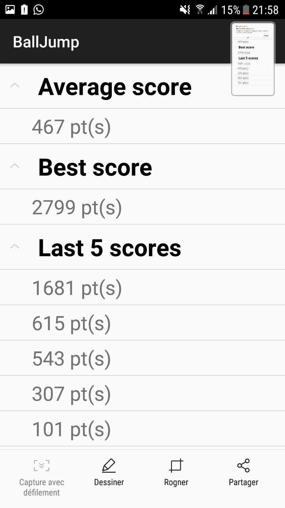
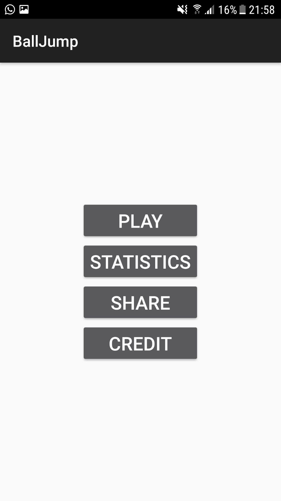
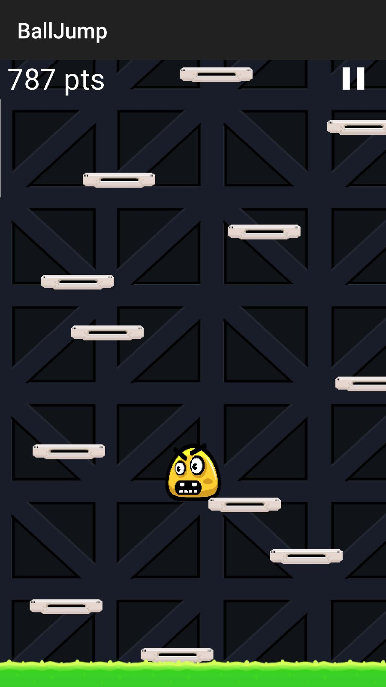
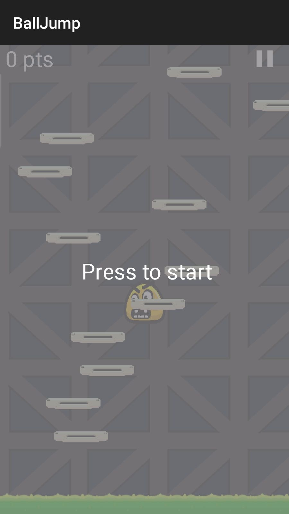

.. role:: raw-latex(raw)
    :format: latex

Principe du jeu
===============

Le jeu se déroule de la manière suivante. Le joueur doit diriger un personnage en inclinant le téléphone de gauche à droite.
Le terrain de jeu est composé d’une multitude de plateformes qui font rebondir le personnage lorsqu'il atterit dessus.

Le but du jeu est d’arriver le plus haut possible.
Les plateformes se génèrent au fur et mesure que le personnage monte.
Des items qui permettront de débloquer des bonus se trouveront également dans le décore.

Structure
=========

MenuActivity
^^^^^^^^^^^^

Première activitée à être lancé lors de l'ouverture de l'application. Elle permet juste d'afficher le menu principal qui contient les boutons suivant.

:raw-latex:`\medskip`

* PLAY : lancer le jeu
* STATISTICS : affiche des statistiques sur les scores
* SHARE	: partage de scores en bluetooth
* CREDIT : crédit du jeu

:raw-latex:`\medskip`
Ensuite, en fonction des boutons pressés, l'activité va lancer les activités correspondante.

Statistics
^^^^^^^^^^

Statistics va lire les données d'un fichier .txt afin d'en calculer une moyenne, d'en afficher le meilleur score et le score des cinq dernières parties.

:raw-latex:`\medskip`
Les score seront affichés à l'aide d'une expandable list view, cette dernière est légèrement plus complexe qu'une liste car son adapteur est plutôt difficile d'utilisation. C'est pour cela qu'il a fallu en créer un qui étend la classe BaseExpandableListAdapter pour en redéfinir ses fonctions en utilisant une liste (correspondants aux éléments sous un titre) et un dictionnaire qui contiendra comme clé le titre et comme valeur les listes.

    Statistiques de jeu

La figure $\ref{img/stats.jpeg}$ illustre l'affichage des statistiques.

SensorAccelerationActivity
^^^^^^^^^^^^^^^^^^^^^^^^^^

Cette classe s'occupe d'instancier le panel ainsi que de gèrer les capteurs. Elle utilise l'accéléromètre et le magnétomètre pour pouvoir trouver l'angle de l'appareil.

:raw-latex:`\medskip`
Pour cela, la classe implémente SensorEventListener et doit surcharger la fonction onSensorChanged() qui est appelée à chaque changement de valeur des capteurs. Dans cette fonction la valeur des deux capteurs est récupérée et la classe SensorManager est utilisée pour calculer l'angle de la manière suivante.

:raw-latex:`\medskip`
Les résultats des capteurs sont transmis à la fonction getRotationMatrix() de la classe SensorManager qui prend comme paramètre 4 tableaux, 2 qui viennent des capteurs et 2 tableauy dans lesquels seront stockés les résultat.

:raw-latex:`\medskip`
Un de ces tableau correspond à une matrice de rotation qui est passée dans une autre fonction de SensorManager qui se nomme getOrientation(). Celle-ci va retourner un tableau d'angle selon tous les axes. L'angle qui nons intéresse est ensuite transmis au panel pour qu'il fasse bouger le personnage du jeu.

GamePanel
^^^^^^^^^

Cette classe est la classe principale de notre projet, c'est dans cette dernière que toutes les fonctions essentielles sont appelées et utilisées pour le bon fonctionnement du jeu.

:raw-latex:`\medskip`
Parmis ces fonctions se trouve la fonction update qui se chargera de mettre à jour les mouvements de tous les objets qui sont affichés à l'aide de la fonction draw. C'est dans le GamePanel que les appels de la logique du jeu se trouvent, par exemple lorsque le joueur meurt on appelle la fonction de SensorAccelerationActivity qui permet de déplacer le joueur dans un menu de GameOver.

Plateform
^^^^^^^^^

Afin de créer ces blocs permettant au joueur de rebondir, nous avons mis en place une classe qui créera des rectangles servant de plateformes. Dans cette classe, nous trouverons les fonctions qui permettent de les déplacer, les redessiner et d'instaurer une logique permettant de rendre une plateforme sur 40 "destructible". Destructible signifie qu'une fois que le joueur rebondit sur la plateforme, cette dernière se détruit.

Player
^^^^^^

Dans la classe du joueur, on implémente les fonctions de ses mouvements, de ses collision avec une plateforme et de son rebond continuel.

GameOver
^^^^^^^^

L'activité Game Over intervient lorsque le joueur tombe mais n'arrive pas à rebondir sur une plateforme. Cette activité permet de soit directement jouer une nouvelle partie, ou alors de retourner au menu afin d'observer les scores par exemple.

ShareActivity
^^^^^^^^^^^^^

Permet de choisir entre paratger son score ou reçevoir celui d'un autre joueur. Afin que 2 joueurs se partagent les scores un joueur doit presser le bouton GET SCORE et l'autre doit presser SEND SCORE.

ServerActivity
^^^^^^^^^^^^^^

Crée le serveur et affiche une liste d'adresses ip. De plus, quand un joueur se connecte et partage son score, il est également affiché.

ClientActivity
^^^^^^^^^^^^^^

Possède une zone de texte éditable pour entrer l'adresse IP du serveur et un texte qui affiche si le client est connecté ou pas. Cette activité possède également deux boutons, un qui permet de se connecter au serveur et un autre qui permet d'envoyer le score une fois connecté au serveur.

Fonctionnalités
===============

Cette section développe les fonctionnalités développées et utilisées dans le jeu.

    Menu

La figure $\ref{img/menu.jpeg}$ illustre le menu du jeu.

Capteurs
^^^^^^^^

Dans le cadre de ce projet, les capteur utilisé sont l'accéléromètre et le magnétomètre.

Selon Wikipédia_,

    *Un accéléromètre est un capteur qui, fixé à un mobile ou tout autre objet, permet de mesurer l'accélération linéaire de ce dernier. On parle d'accéléromètre même lorsqu'il s'agit en fait de 3 accéléromètres qui calculent les accélérations linéaires selon 3 axes orthogonaux.*

Il s'agit plus simplement d'un capteur qui permet de détecter les mouvements du téléphone.
Dans ce projet, il est utilisé pour détecter les changements d'orientation afin de déplacer le joueur sur l'axe horizontal du jeu.

:raw-latex:`\medskip`
Le magnétomètre lui est un capteur qui détecte les changements dans le champ magnétiques avoisinant.

:raw-latex:`\medskip`
Dans une utilisation combinée, ces deux capteurs permettent de détecter l'inclinaison du téléphone et donc de déplacer le joueur.

Plateformes
^^^^^^^^^^^

La génération aléatoire des plateformes se fait dans la fonction plateformsGeneration se trouvant dans le GamePanel. On va tester si le joueur atteint la moitié de l'écran afin de générer un ensemble de plateformes sur un delta que le joueur a pu grimper. De cette façon on a l'impression que le joueur monte de façon fluide.

    Illustration du jeu

La figure $\ref{img/jeu.jpeg}$ illustre ces plateformes.

Rebonds
^^^^^^^

Pour les rebonds c'est assez simple, quand une colision est détecté entre le joueur et une plateforme on assigne une vitesse au joueur positive. Cela a pour éffet de faire monter le personnage. A chaque déplacement du joueur la vitesse est décrémentée. Donc il va monter de moins en moins vite et ensuite la vitesse va devenir négative par conséquent le joueur va redéscendre jusqu'à atteindre une vitesse maximum. Ensuite si il entre a nouveu en collision il va remonter à nouveau.

:raw-latex:`\medskip`
Le joueur monte seulement jusqu'à la moitié de l'écran et ensuite ce sont les plateformes qui descendent. Ceci a pour but de donner l'impression que le joueur monte. Cette manière de faire évite que le joueur sorte de l'écran vers le haut si il saute plusieurs fois de suite.

Persistance
^^^^^^^^^^^

Dans le but de pouvoir créer des statistiques, les scores sont sauvegardés dans un fichier texte. Afin de simplifier le stockage et n'ayant qu'un champ à sauvegarder, cette solution est avantageuse comparée à une utilisation d'une base de données.

Partage des scores
^^^^^^^^^^^^^^^^^^

Au départ nous avions décidé de faire le partage des scores par bluetooth mais nous ne somme pas parvenus à le faire fonctionner. De ce fait, nous avons décideé de faire cela avec des sockets.
Après avoir pressé le bouton "SHARE", une page s'affiche avec deux boutons. Le premier afin de recevoir le score d'un autre joueur (le serveur) et le second afin d'envoyer son score (le client).

:raw-latex:`\medskip`
Ci après sont décrits les deux cas d'utilisation.

:raw-latex:`\medskip`
Serveur:
Étant donné qu'il n'a pas été possible de déterminer exactement l'adresse IP de destination, le serveur affiche une liste d'adresses. Il est nécessaire de les essayer une à une afin de trouver laquelle permet la connexion. Suite à cela, le serveur affiche les scores de l'autre joueur.

:raw-latex:`\medskip`
Client:
Une zone de texte permet l'entrée de l'adresse IP du serveur et un bouton CONNECT permet la connection. Un texte va afficher le résultat de la connexion. Un second  permet d'envoyer le score au serveur correspondant.

Problèmes rencontrés
====================

Cette section détaille les problèmes rencontrés, qu'il s'agisse d'un point de vue matériel ou de développement.

Liés aux appareils
^^^^^^^^^^^^^^^^^^

Capteurs
""""""""

Tous les téléphones ne disposant pas des mêmes capteurs et l'emulateur ne permettant pas de simuler des orientations, il a été difficile de pouvoir tester l'application. En effet, les tablettes prêtées par l'école ne disposent pas d'accéléromètre.

:raw-latex:`\medskip`
Ce problème a induit un codage à "l'aveugle" pour les étudiants ne disposant pas d'autres appareils Androïd. De plus, il n'a été possible de réaliser au préalable les tests uniquement sur un téléphone.

Puissance de calcul
"""""""""""""""""""

Tous les appareils ne disposant pas du même processeur et de la même quantité de RAM_, le jeu ne se déroulait pas à la même vitesses sur tous les périphériques.

:raw-latex:`\medskip`
Il a été nécessaire de trouver un moyen de ralentir les appareils trop rapides afin que l'expérience utilisateur soit toujours autant agréable.
Les appareils plus lents quant à eux ne sont pas ralentis et affichent le jeu au maximum de leur capacités.

Il est donc possible que le jeu se déroule plus lentement sur certains appareils, mais jamais "trop" vite.

Liés au développement
^^^^^^^^^^^^^^^^^^^^^

Collisions non détectées
""""""""""""""""""""""""

Lorsque le joueur retombait à vitesse maximale, certaines collision n'étaient pas détectées. La cause était la suivante. En une frame, le joueur pouvait passer d'une position située au dessus de la plateforme à une position située au dessous de celle-ci. Dès lors, les collisions n'étaient jamais détectées étant donné que le joueur n'entrait jamais en contact avec la plateforme.

:raw-latex:`\medskip`
Afin de régler le problème, l'épasseur des plateformes a du être augmenté virtuellement. C'est a dire que visuellement leurs dimensions restent inchangées mais elles sont plus épaisses dans la fonction de détection des collisions. De cette manière, il n'est plus possible de traverser une plateforme en une seul frame.

Panel qui ne se re-dessine pas
""""""""""""""""""""""""""""""

Lors d'une pression sur le bouton PLAY dans le menu principal, une page blanche s'affichait parfois pendant plusieurs dizaine de secondes.

:raw-latex:`\medskip`
Après quelques recherches, il a été découvert que le problème découlait du verrouillage du canevas. Après l'avoir verrouillé et avoir dessiné sur ce dernier les éléments nécessaires, sa libération n'était pas effectuée correctement.

Suite à cette modification, il a été observé que l'affichage ne se chargeait qu'après un cours délai. Pour palier à ce problème, il a été décidé de ne pas démarrer le jeu automatiquement. À contrario, le jeu ne démarre pas tant que le joueur n'a pas touché l'écran.

    Toucher l'écran pour commencer

La figure $\ref{img/presstostart.jpeg}$ illustre cette solution.

Bugs connus
===========

Lors de l'ouverture des statistiques, si aucune partie n'a été jouée, l'application crash. En effet, la lecture d'un fichier vide pose problème. Une solution simple n'a pas pu être trouvée dans les temps.

Conclusion
==========

Dans l'ensemble, le projet est une réussite. Le cahier des charges a été rempli malgré un changement de technologie de dernière minute pour le partage des scores. Le résultat final correspond aux attentes des membres.

:raw-latex:`\medskip`
Cependant, le planning n'a pas été respecté dans son sens premier. Les graphismes ont été améliorés plus tôt que prévu et le partage des scores a nécessité plus de temps.

:raw-latex:`\medskip`
Malgré l'implémentation des fonctionnalités prévues, le manque de temps pour l'amélioration du design des menus est regrettable. Le jeu n'a de ce fait pas d'identité propre à lui.

:raw-latex:`\medskip`
Ce projet est pour nous une réussite. Il nous a donné l'opportunité d'apprendre à utiliser une nouvelle technologie et de réaliser une application presque fonctionnelle.

.. Bibliographie

.. _Wikipédia: https://fr.wikipedia.org/wiki/Accéléromètre
.. _RAM: https://fr.wikipedia.org/wiki/Mémoire_vive
